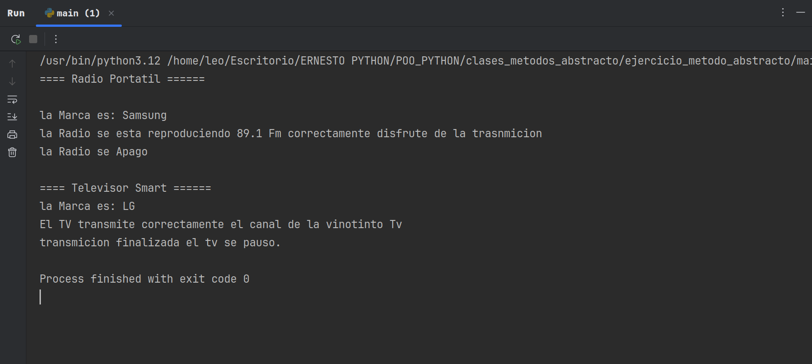

# Programa Aplicando Metodo Abstracto (ABC) Abstracmethod.
En este ejercicio podemos verificar como aplicamos el metodo abstracto, con sus
decoradores  Getter,  Setter, para la manipulacion de los Atributos Respectivos, y
especificando cada metodo sin implementacion para aplicar la abstraccion de una manera simple y 
explicativa 

- Funcionamiento:  DispositivoMultimedia: es la clase abstracta que de ella se toma como base sus metodos sin implementacion para las otras clases:
  RadioPortayil, y Television. En ambas se hace la Implementacion para Ejecutar los metodos abstractos.

  
